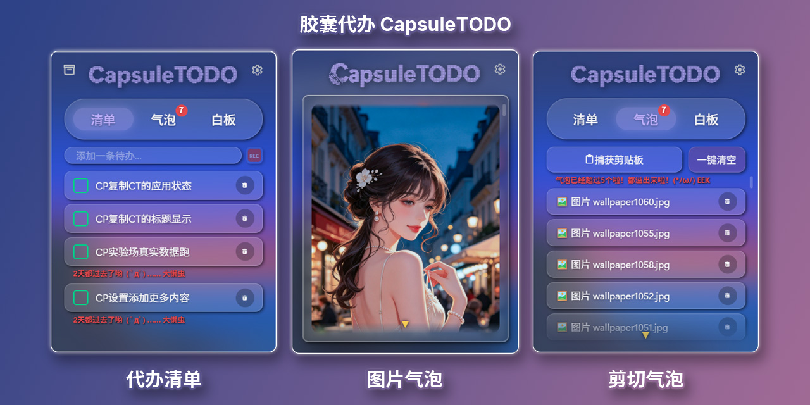

# 🧊 CapsuleTODO

**简体中文** | [English](#english)

[](../../actions/workflows/ci.yml)
[](../../releases)
[](#下载)
[](https://www.rust-lang.org)
[](https://vuejs.org)
[](LICENSE)

<p align="center">
  
</p>

---

## 中文版

一款玻璃质感的桌面 Todo 看板——常驻桌面一隅，随手记、随手勾。聚焦时是真实的 Windows 亚克力磨砂，失焦时回归透明，深浅色随系统；再配上一枚全局热键，把任何软件里闪过的念头随手收进气泡。

### ✨ 功能亮点

- 🪟 **会呼吸的玻璃** —— 焦点联动 DWM 亚克力（聚焦磨砂、失焦透明），深浅色跟随系统
- ⚡ **顺手捕获** —— 任意软件中按全局热键（默认 `Ctrl+Alt+C`），选中文字或图片直接捕获（自动复制），内容落为气泡并自动去重
- 🖼️ **图片气泡** —— 截图 / 图片文件也能收进气泡；单击看大图、双击用系统程序开原图，复制回保真
- 📝 **待办清单** —— 单击勾选入档、双击行内改名、拖拽排序、详情板写笔记（有笔记的行左上角红点提示）
- 💬 **气泡便签** —— 单击看全文、双击复制回剪贴板、拖拽排序、满额提醒（默认 5 条可调）
- 🧽 **白板** —— 随写随存的草稿板
- 📌 **托盘常驻** —— 悬停托盘图标实时预览待办；双击标题缩回托盘
- 🎒 **绿色便携** —— 单文件 exe，数据全部落在同级 `configs\` 与 `data\`（图片存 `data\images\`）

### 📥 下载

从 [Releases](../../releases) 下载 `CapsuleTODO_v0.2.2_win_x64.zip`，解压到任意目录，双击 `capsule-todo.exe` 即用——无需安装、不写注册表，首次运行自动在 exe 同级创建 `configs\` 与 `data\`。备份/迁移 = 拷走这两个文件夹。

> 💡 Windows 10/11（64 位）。玻璃磨砂依赖系统合成器，部分 Win10 旧版本观感略有差异；macOS/Linux 适配在 Windows 版成熟后推进。

### 🧱 技术栈

| 层      | 选型                                | 说明                                      |
| ------- | ----------------------------------- | ----------------------------------------- |
| 📦 壳   | Tauri 2（Rust + 系统 WebView）      | 包体小（~13MB），系统能力原生接入         |
| 🦀 核心 | 纯 Rust——状态机 / SQLite / 业务规则 | 全部业务逻辑在 Rust 侧，`cargo test` 直测 |
| 🖼️ 前端 | Vue 3 + TypeScript + Vite           | 只做展示，零业务逻辑                      |
| 🗄️ 存储 | SQLite（rusqlite）                  | 零配置本地库                              |
| 🪟 玻璃 | DWM SYSTEMBACKDROP 焦点联动         | 系统级真亚克力，无组合引擎 hack           |

### 🛠️ 开发

```bash
npm install         # 首次
cargo test          # Rust 核心全量测试（不依赖 UI）
npm run tauri dev   # 开发运行（静态前端内嵌——改前端后先 npm run build）
npm run build       # 前端构建（含 vue-tsc 类型检查）
```

> 🔧 需要 Rust 工具链与 Node.js 26+；dev 模式运行时数据落项目根 `configs/` 与 `data/`。

### 🏗️ 架构一句话

待办状态机、持久化、校验、托盘状态机、热键运行时——全部业务逻辑为纯 Rust 并有测试覆盖；Vue 层只做渲染与命令转发。

### 📁 项目结构

```
CapsuleTODO/
├── core/                      # 🦀 Tauri 2 后端（版本单一来源：Cargo.toml）
│   ├── src/
│   │   ├── lib.rs             # 应用装配：窗口 / 托盘 / 热键 / 图片迁移 / 命令注册
│   │   ├── main.rs            # 薄入口（release 免黑控制台窗）
│   │   ├── todo.rs            # 待办纯逻辑（DTO + 文本校验）
│   │   ├── bubble.rs          # 气泡纯逻辑（DTO + 捕获校验 + 文本/图片类型）
│   │   ├── whiteboard.rs      # 白板纯逻辑（内容长度校验）
│   │   ├── storage.rs         # SQLite 仓储（三表，参数化 SQL；图片落盘命名/去重/清理）
│   │   ├── settings.rs        # 设置持久化（位置 / 上限 / 热键 / 置顶 / 吸附 / 主题）
│   │   ├── paths.rs           # 运行时数据双落址（configs/ + data/ + data/images/）
│   │   ├── capture.rs         # 圈选捕获（剪贴板等待状态机 + 合成复制）
│   │   ├── clipboard_image.rs # 剪贴板图片读写（编解码 + 文件引用 + 预览生成）
│   │   ├── hotkey.rs          # 全局热键（组合解析 + 注册线程）
│   │   ├── tray.rs            # 托盘（预览显隐状态机 + 自绘菜单）
│   │   ├── fullscreen.rs      # 全屏让位（前台窗口轮询）
│   │   ├── snap.rs            # 贴边吸附纯函数
│   │   ├── glass_backdrop.rs  # 玻璃背板（DWM SYSTEMBACKDROP 焦点联动）
│   │   └── commands/          # Tauri 命令层（薄封装，核心可脱离 Tauri 直测）
│   ├── capabilities/          # ACL 权限白名单（拖动等前端能力）
│   ├── icons/                 # 应用图标（正式五件套 + 设计源）
│   ├── tests/                 # 集成测试（真实文件库探针 / 迁移）
│   └── tauri.conf.json        # 窗口 / CSP / 打包配置
├── ui/                        # 🖼️ Vue 3 前端（只做展示，零业务逻辑）
│   ├── src/components/        # 三页签 + 详情板 + 设置板 + 托盘窗等组件
│   ├── src/composables/       # 组合式逻辑（玻璃滑杆 / 整板阅读 / 罩死 / 拖拽 …）
│   ├── src/styles/            # 样式层（玻璃卡 / 清单 / 气泡 / 详情 …）
│   ├── src/dev/               # 冒烟基座与 mock（浏览器直跑）
│   └── types.ts               # IPC DTO 类型镜像（与 Rust serde 同源）
├── design/                    # 🎨 HTML/CSS/JS 设计原型（三页签全交互，实现的事实参照）
├── release/                   # 📦 绿色包使用说明（随 zip 分发的那份 README）
├── configs/                   # ⚙️ 运行时设置 config.json（gitignore，运行时自建）
├── data/                      # 🗄️ 运行时数据 todo.db + images/（gitignore，运行时自建）
├── AGENTS.md                  # 📐 工程规范与协作纪律
├── CapsuleTODO_plan.md        # 🗺️ 总体规划与分期
├── z.plan.md                  # 📋 专题方案与全量审计归档
├── x.progress.md              # ✅ 任务清单与进度
├── y.problems.md              # 🐞 问题与远期改进备忘录
├── w.study.md                 # 🔬 项目分析报告
└── .agents/skills/            # 🤖 项目自建审计 skill
```

### 🗺️ 路线图

- ✅ 一期 —— 玻璃待办板（勾选入档 / 详情 / 拖拽排序）
- ✅ 二期 —— 剪贴板气泡 + 全局热键 + 白板（含图片气泡）
- 🔭 三期 —— AI 辅助规范待办（探索中）
- ⏳ macOS / Linux 适配

### 📄 许可

以 [MIT License](LICENSE) 开源。

### 🧬 系列

Capsule 系列第四作：CapsuleRetro（包装游戏）→ CapsulePlan（落定计划）→ CapsulePulse（记录时间）→ **CapsuleTODO（桌面清单）**。

---

<a id="english"></a>

## English

A glassmorphic desktop TODO board that lives in the corner of your screen — real Windows Acrylic that turns frosty when focused and crystal-clear when idle, following your system theme. Plus a global hotkey to sweep fleeting thoughts from any app into bubbles.

### ✨ Highlights

- 🪟 **Glass that breathes** — focus-linked DWM Acrylic (frosted when active, transparent when idle), light/dark follows the OS
- ⚡ **Frictionless capture** — press the global hotkey (default `Ctrl+Alt+C`) anywhere, even with text selected (auto-copy & capture); snippets land as bubbles, deduplicated automatically
- 🖼️ **Image bubbles** — screenshots and image files land as bubbles too; click to view large, double-click to open the original, copy back faithfully
- 📝 **Todo board** — one-click archive, inline rename (double-click), drag to reorder, per-item notes & detail panel (rows with a note show a red dot)
- 💬 **Bubble tray** — full-text view, copy-back on double-click, drag to reorder, configurable capacity reminder (default 5)
- 🧽 **Whiteboard** — a scratch pad that saves itself
- 📌 **Tray-native** — hover the tray icon for a live todo preview; double-click the title to tuck the board back into the tray
- 🎒 **Portable** — a single exe; all data stays in `configs/` + `data/` beside it (images under `data/images/`)

### 📥 Download

Grab `CapsuleTODO_v0.2.2_win_x64.zip` from [Releases](../../releases), unzip anywhere, and run `capsule-todo.exe`. No installer, no registry writes — first launch creates `configs\` and `data\` next to the exe. To back up or migrate, just copy those two folders.

> 💡 Windows 10/11 x64. The acrylic effect depends on the OS compositor; older Win10 builds may look slightly different. macOS/Linux support is planned after the Windows release matures.

### 🧱 Built With

| Layer      | Choice                                             | Why                                                          |
| ---------- | -------------------------------------------------- | ------------------------------------------------------------ |
| 📦 Shell   | Tauri 2 (Rust + system WebView)                    | tiny footprint (~13 MB), native capabilities                 |
| 🦀 Core    | Pure Rust — state machines, SQLite, business rules | all logic lives in Rust, directly unit-tested (`cargo test`) |
| 🖼️ UI      | Vue 3 + TypeScript + Vite                          | presentation only, zero business logic                       |
| 🗄️ Storage | SQLite via rusqlite                                | zero-config local database                                   |
| 🪟 Glass   | DWM `SYSTEMBACKDROP` focus-linking                 | real OS Acrylic, no composition-engine hacks                 |

### 🛠️ Develop

```bash
npm install         # once
cargo test          # Rust core: full test suite, no UI required
npm run tauri dev   # dev run (static frontend bundle — rebuild via npm run build after UI edits)
npm run build       # frontend build incl. vue-tsc type check
```

> 🔧 Requires the Rust toolchain and Node.js 26+. Runtime data lands in `configs/` + `data/` at the project root in dev mode.

### 🏗️ Architecture in One Line

All business logic — todo state machine, persistence, validation, tray state machines, hotkey runtime — is pure Rust and covered by `cargo test`; the Vue layer only renders and forwards commands.

### 📁 Project Structure

```
CapsuleTODO/
├── core/                      # 🦀 Tauri 2 backend (version source of truth: Cargo.toml)
│   ├── src/
│   │   ├── lib.rs             # app wiring: window / tray / hotkey / image migration / command registry
│   │   ├── main.rs            # thin entry point (no console window in release)
│   │   ├── todo.rs            # todo pure logic (DTO + text validation)
│   │   ├── bubble.rs          # bubble pure logic (DTO + capture validation + text/image kind)
│   │   ├── whiteboard.rs      # whiteboard pure logic (length validation)
│   │   ├── storage.rs         # SQLite repository (3 tables, parameterized SQL; image naming/dedup/cleanup)
│   │   ├── settings.rs        # settings persistence (position / limit / hotkey / on-top / snap / theme)
│   │   ├── paths.rs           # runtime dual-location paths (configs/ + data/ + data/images/)
│   │   ├── capture.rs         # selection capture (clipboard-wait state machine + synthetic copy)
│   │   ├── clipboard_image.rs # clipboard image I/O (codecs + file refs + preview generation)
│   │   ├── hotkey.rs          # global hotkey (combo parsing + registration thread)
│   │   ├── tray.rs            # tray (preview visibility state machine + custom menu)
│   │   ├── fullscreen.rs      # fullscreen yield (foreground-window polling)
│   │   ├── snap.rs            # edge-snap pure functions
│   │   ├── glass_backdrop.rs  # glass backdrop (DWM SYSTEMBACKDROP focus-linking)
│   │   └── commands/          # Tauri command layer (thin shell; cores are Tauri-free & directly testable)
│   ├── capabilities/          # ACL allowlist (drag & other frontend capabilities)
│   ├── icons/                 # app icons (release set + design source)
│   ├── tests/                 # integration tests (real-file DB probe / migration)
│   └── tauri.conf.json        # window / CSP / bundle config
├── ui/                        # 🖼️ Vue 3 frontend (presentation only, zero business logic)
│   ├── src/components/        # three tabs + detail / settings overlays + tray windows
│   ├── src/composables/       # composables (glass slider / board read / mask-dead / drag …)
│   ├── src/styles/            # style layer (glass card / list / bubbles / detail …)
│   ├── src/dev/               # smoke-test harness & mocks (runs in a browser)
│   └── types.ts               # IPC DTO type mirror (same source as Rust serde)
├── design/                    # 🎨 HTML/CSS/JS design prototype (fully interactive, source of truth for looks)
├── release/                   # 📦 portable-package README (shipped inside the zip)
├── configs/                   # ⚙️ runtime settings config.json (gitignored, auto-created)
├── data/                      # 🗄️ runtime database todo.db + images/ (gitignored, auto-created)
├── AGENTS.md                  # 📐 engineering conventions & collaboration discipline (Chinese)
├── CapsuleTODO_plan.md        # 🗺️ product plan & phases (Chinese)
├── z.plan.md                  # 📋 specs & full audit archive
├── x.progress.md              # ✅ task list & progress
├── y.problems.md              # 🐞 issues & future improvements memo
├── w.study.md                 # 🔬 project analysis report
└── .agents/skills/            # 🤖 project-built audit skills
```

### 🗺️ Roadmap

- ✅ Phase 1 — glass todo board (check, archive, detail, drag reorder)
- ✅ Phase 2 — clipboard bubbles + global hotkey + whiteboard (incl. image bubbles)
- 🔭 Phase 3 — AI-assisted todo structuring (exploration)
- ⏳ macOS / Linux adaptors (after Windows matures)

### 📄 License

Released under the [MIT License](LICENSE).

### 🧬 Series

Part of the **Capsule** series: CapsuleRetro (game wrapper) → CapsulePlan (planner) → CapsulePulse (time tracker) → **CapsuleTODO (desktop list)**.
